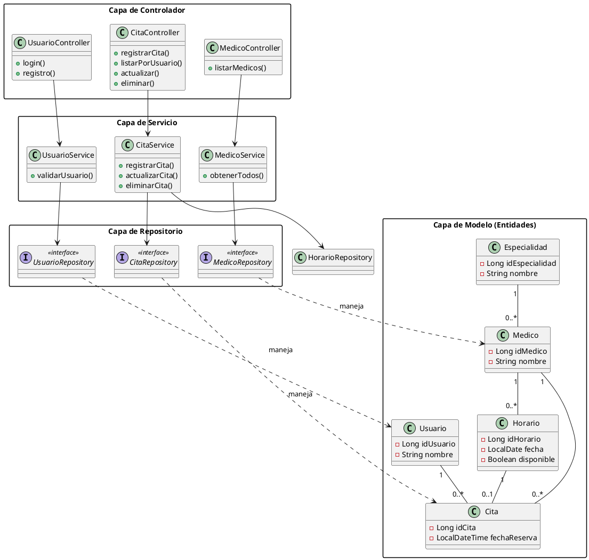

# 4. MODELADO DEL SISTEMA

## 4.1 Clases, objetos, atributos y métodos

A continuación, se describen las clases principales que conforman el modelo de dominio del sistema de gestión de citas médicas. Estas clases representan las entidades fundamentales y su comportamiento básico (getters, setters y constructores) para la persistencia y manipulación de datos.

### 1. Clase: Usuario
Representa a los pacientes o usuarios del sistema que pueden reservar citas.

*   **Atributos:**
    *   `idUsuario` (Long): Identificador único autoincremental.
    *   `nombre` (String): Nombre del usuario.
    *   `apellido` (String): Apellido del usuario.
    *   `dni` (String): Documento Nacional de Identidad (único).
    *   `email` (String): Correo electrónico para acceso y notificaciones (único).
    *   `password` (String): Contraseña encriptada del usuario.
    *   `telefono` (String): Número de contacto.
    *   `fechaRegistro` (LocalDateTime): Fecha y hora en que se creó la cuenta.
*   **Métodos:**
    *   `getIdUsuario()`, `setIdUsuario(Long id)`: Métodos de acceso para el ID.
    *   `getNombre()`, `setNombre(String nombre)`: Métodos de acceso para el nombre.
    *   `getEmail()`, `setEmail(String email)`: Métodos de acceso para el correo.
    *   `getPassword()`, `setPassword(String password)`: Métodos de acceso para la contraseña.
    *   *(Y demás métodos getter/setter para cada atributo)*.
    *   `Usuario()`: Constructor vacío.
    *   `Usuario(...)`: Constructor con parámetros para inicialización completa.

### 2. Clase: Medico
Representa al personal médico disponible para atender las citas.

*   **Atributos:**
    *   `idMedico` (Long): Identificador único autoincremental.
    *   `nombre` (String): Nombre del médico.
    *   `apellido` (String): Apellido del médico.
    *   `dni` (String): Documento de identidad del médico.
    *   `email` (String): Correo electrónico profesional.
    *   `telefono` (String): Teléfono de contacto.
    *   `especialidad` (Especialidad): Relación con la clase Especialidad (Muchos a Uno).
*   **Métodos:**
    *   `getIdMedico()`, `setIdMedico(Long id)`: Métodos de acceso.
    *   `getNombre()`, `setNombre(String nombre)`: Métodos de acceso.
    *   `getEspecialidad()`, `setEspecialidad(Especialidad esp)`: Gestión de la especialidad asignada.
    *   `Medico()`: Constructor por defecto.
    *   `Medico(...)`: Constructor parametrizado.

### 3. Clase: Especialidad
Define las áreas médicas (ej. Pediatría, Cardiología) a las que pertenecen los médicos.

*   **Atributos:**
    *   `idEspecialidad` (Long): Identificador único.
    *   `nombre` (String): Nombre de la especialidad (único).
    *   `descripcion` (String): Detalle sobre el área médica.
*   **Métodos:**
    *   `getNombre()`, `setNombre(String nombre)`: Métodos de acceso.
    *   `Especialidad()` y `Especialidad(...)`: Constructores.

### 4. Clase: Horario
Representa la disponibilidad temporal de un médico en una fecha y hora específica.

*   **Atributos:**
    *   `idHorario` (Long): Identificador único.
    *   `medico` (Medico): Médico al que pertenece el horario.
    *   `fecha` (LocalDate): Fecha del turno.
    *   `hora` (LocalTime): Hora del turno.
    *   `disponible` (Boolean): Estado de disponibilidad (True si está libre, False si ya fue reservado).
*   **Métodos:**
    *   `getDisponible()`, `setDisponible(Boolean estado)`: Control de disponibilidad.
    *   `getMedico()`, `setMedico(Medico medico)`: Vinculación con el médico.
    *   `Horario()` y `Horario(...)`: Constructores.

### 5. Clase: Cita
Es la entidad central que vincula al usuario, el médico, la especialidad y el horario reservado.

*   **Atributos:**
    *   `idCita` (Long): Identificador único de la reserva.
    *   `usuario` (Usuario): Paciente que reserva la cita.
    *   `medico` (Medico): Médico asignado.
    *   `especialidad` (Especialidad): Especialidad de la consulta.
    *   `horario` (Horario): Horario específico seleccionado.
    *   `fechaReserva` (LocalDateTime): Fecha y hora en la que se realizó la transacción.
*   **Métodos:**
    *   `getUsuario()`, `setUsuario(Usuario u)`: Acceso al paciente.
    *   `getHorario()`, `setHorario(Horario h)`: Acceso al bloque de tiempo.
    *   `Cita()` y `Cita(...)`: Constructores.

---

## 4.2 Diagrama UML

A continuación se presenta el modelo estructural y de relaciones entre entidades mediante un diagrama de clases UML:

### Relaciones entre Clases
1.  **Usuario - Cita (1:N):** Un Usuario puede reservar muchas Citas, pero una Cita pertenece a un único Usuario.
    *   *UML:* Asociación dirigida de `Cita` hacia `Usuario`.
2.  **Medico - Especialidad (N:1):** Muchos Médicos pueden pertenecer a una misma Especialidad.
    *   *UML:* Asociación de `Medico` hacia `Especialidad`.
3.  **Medico - Horario (1:N):** Un Médico tiene múltiples horarios de atención disponibles.
    *   *UML:* Composición o asociación fuerte de `Horario` hacia `Medico`.
4.  **Cita - Medico (N:1):** Muchas Citas pueden ser atendidas por el mismo Médico.
5.  **Cita - Horario (1:1):** Una Cita reservada ocupa exactamente un Horario específico, y ese horario queda vinculado a esa cita.

### Representación Visual Completa (PlantUML)
A continuación se presenta el diagrama que integra todas las capas de la aplicación:

### Recomendaciones de Diseño:
*   **Visibilidad:** Utiliza el símbolo `+` para atributos y métodos públicos, y `-` para privados (encapsulamiento).
*   **Tipos de Datos:** Asegúrate de incluir los tipos (String, Long, LocalDateTime) para mantener la fidelidad con el código fuente.
*   **Navegabilidad:** Las flechas deben indicar que la Cita "conoce" al Usuario y al Médico para facilitar la trazabilidad de la reserva.
## 4.3 Arquitectura y Estructura del Sistema

El sistema sigue una arquitectura de capas (Layered Architecture) basada en el patrón MVC (Modelo-Vista-Controlador) para separar las responsabilidades de manera eficiente:

### 1. Capa de Modelo (Model)
*   **Función:** Representa los datos y la lógica de negocio básica.
*   **Descripción:** Son clases POJO anotadas con `@Entity` que mapean directamente a las tablas de la base de datos MySQL. Define la estructura de la información (Usuario, Medico, Cita, etc.).

### 2. Capa de Repositorio (Repository)
*   **Función:** Acceso a los datos (DAO).
*   **Descripción:** Interfaces que extienden de `JpaRepository`. Se encargan de realizar las operaciones CRUD (Crear, Leer, Actualizar, Borrar) y consultas personalizadas sin necesidad de escribir código SQL manualmente.

### 3. Capa de Servicio (Service)
*   **Función:** Lógica de negocio intermedia.
*   **Descripción:** Aquí se procesan las reglas del sistema. Por ejemplo, antes de registrar una `Cita`, el servicio verifica si el `Horario` está disponible y lo marca como ocupado después de la reserva. Actúa como puente entre el controlador y el repositorio.

### 4. Capa de Controlador (Controller)
*   **Función:** Gestión de peticiones HTTP.
*   **Descripción:** Expone los puntos de entrada (endpoints) del sistema. Recibe las solicitudes del usuario (desde la web o el chatbot), invoca los métodos necesarios en la capa de servicio y devuelve la respuesta correspondiente (JSON o vistas HTML).
